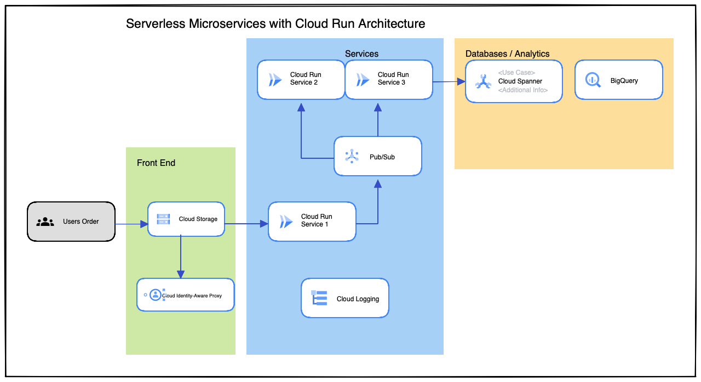

## How to execute Spring Boot PetClinic on GCP

### Prerequisites
- GCP account
- Docker
- Java 8
- Maven 3.6
- Terraform
- gcloud cli

### Architecture


First of all, compile java application inside springapp folder:

````sh
mvn package -DskipTests
````

Compile Docker images:

````sh
docker build -t springapp .
docker tag springapp:latest gcr.io/palestra-ici/springapp:latest
````

And execute Terraform files inside terraform folder:

````sh
terraform apply -auto-approve
````

Test the application accessing URL after Terraform.
